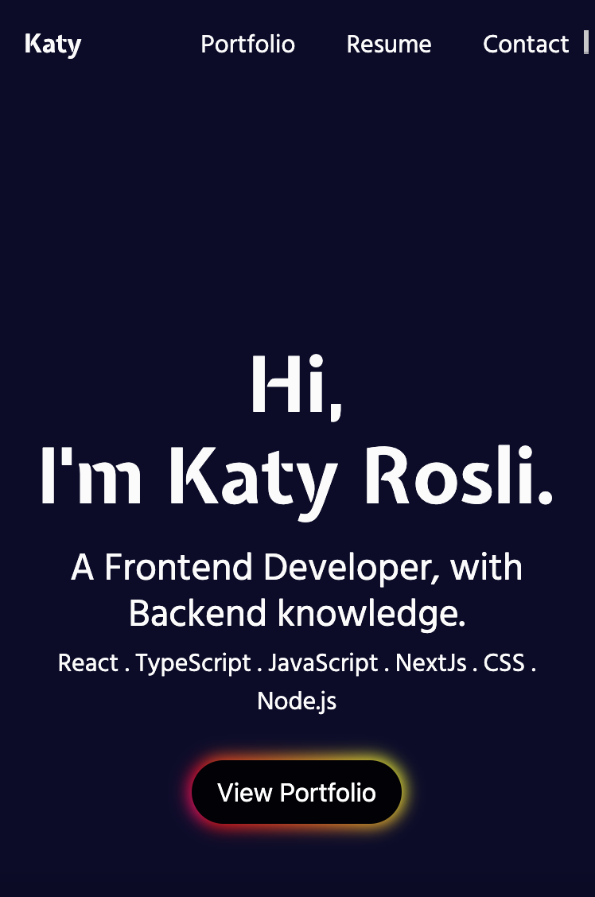

# Online Portfolio :

- A responsive online portfolio website build with React TypeScript. This website show case the latest works and projects done by me.
- This is my first ever project in TypeScript and I think I like TypeScript more than JavaScript:)!

# Built with 🛠️:
- React
- TypeScript
- HTML
- CSS
- Bootstrap
- Figma
- AWS (Amazon Web Service)

# Live Demo:
[Live Demo Link] (https://www.katyrosli.com/)

## Available Scripts
In the project directory, you can run:
`npm start`

Runs the app in the development mode.\
Open [http://localhost:3000](http://localhost:3000) to view it in the browser.

The page will reload if you make edits.\
You will also see any lint errors in the console.
`npm test`

# Author:
👩 **Katy Rosli**
- GitHub: [@KatyRosli](https://github.com/KatyRosli)

# Show your support:
Give a ⭐️ if you like this project!

Thank you!
